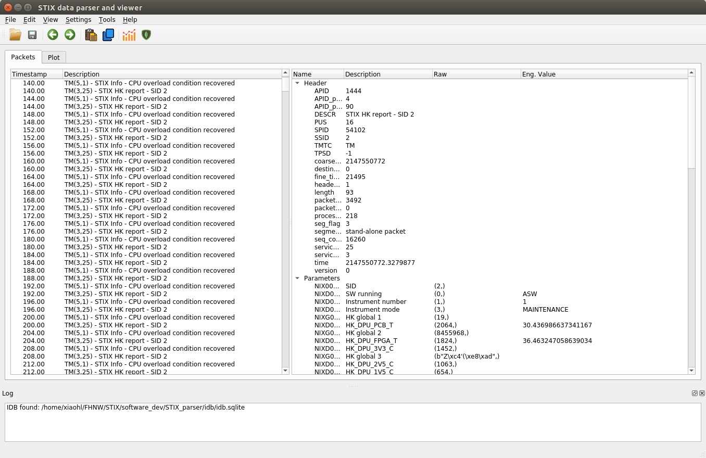
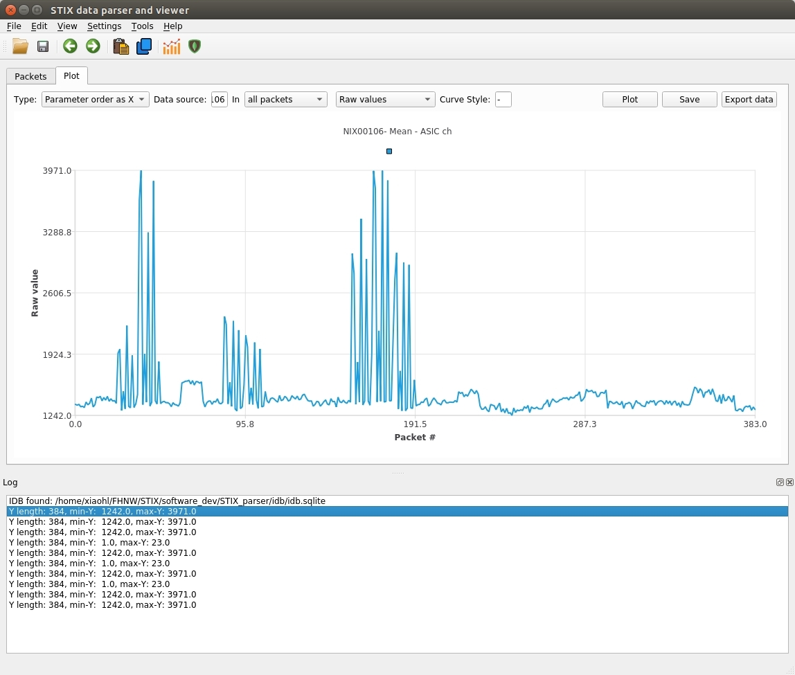

## STIX raw data parser and data viewer

A package to parser STIX ground unit raw data and to view the data. It also allows doing some simple analysis. 
Parsing of raw data is based on IDB.  

### Environment Setup

#### On Linux 
1. Install python 3
  ```
    sudo  apt-get install python3
  ```
2. Install pip
  ```
    sudo apt install python3-pip
  ```
3. Install dependencies:
```
pip3 install numpy xmltodict PyQt5 pyqtchart scipy pymongo pprint
```


### How to use 
1. run in the command line 
```
python3 applications/parser -i <RAW_DATA_FILENAME> -o <OUTPUT>  -v  <Verbose level>
```

2. Use the package in your own code.  Here are two examples

```
#/usr/bin/python3 
from core import stix_logger
from core import stix_parser
stix_logger._stix_logger.set_logger(logfile='inject.log', verbose=2)
parser = stix_parser.StixTCTMParser()
parser.parse_file('raw.binary', 'output.pkl', 0,'tree')
```
Another example

```
from core import stix_logger
from core import stix_parser

f=open('raw.binary','rb')
buffer=f.read()
stix_logger._stix_logger.set_logger('inject.log', verbose=2)
parser = stix_parser.StixTCTMParser()
packets=parser.parse(buffer, 0,'tree')
for packet in packets:
  print(packet['header'])
  print(packet['parameters'])
```


 
  

3. use graphical user interface 
````
python3 UI/parser_gui.py
````
The GUI supports the following data formats:
- STIX raw data
- SOC XML format
- MOC ascii format
- data stored in  pkl, pklz, sqlite database, Nosql mongodb

### Screenshots



